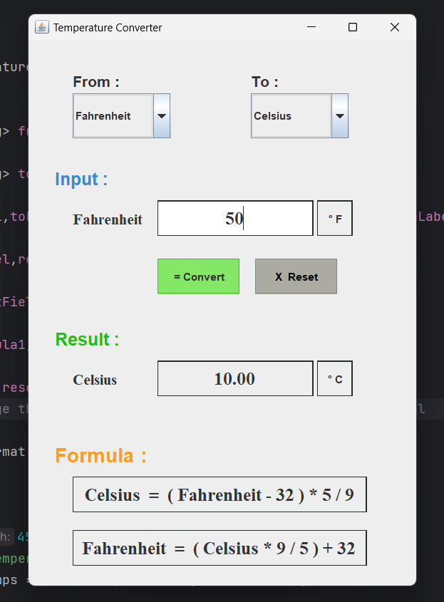

# TemperatureConverter-JavaSwing-MotionCut
This Java Swing application provides a user-friendly interface to convert temperatures between Celsius and Fahrenheit. It allows users to select the input and output temperature scales, enter a temperature value, and see the converted result.

## ABSTRACT :
The Temperature Converter is a simple yet effective Java Swing application designed to facilitate the quick and accurate conversion of temperature values between Celsius and Fahrenheit scales. This user-friendly tool allows users to select the input and output temperature scales, enter a temperature value, and instantly view the converted result. The application offers a clean and intuitive graphical interface with dropdown menus and input fields for ease of use.

## Features
- Convert temperatures between Celsius and Fahrenheit.
- User-friendly interface with dropdown menus and input fields.
- Error handling for non-numeric input.
- Conversion formulas provided for reference.
- Reset button to clear inputs and results.

## Screenshots

